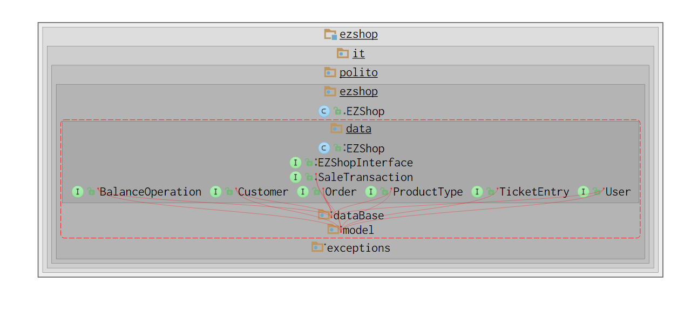
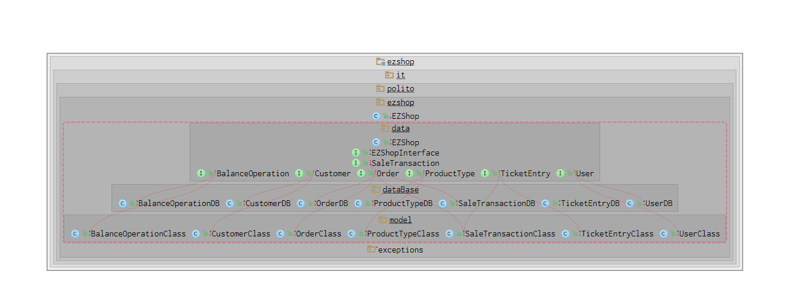
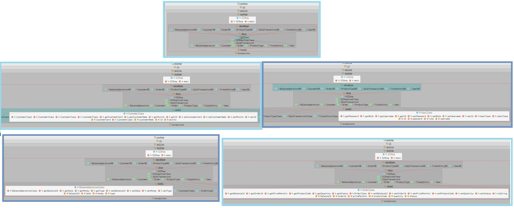
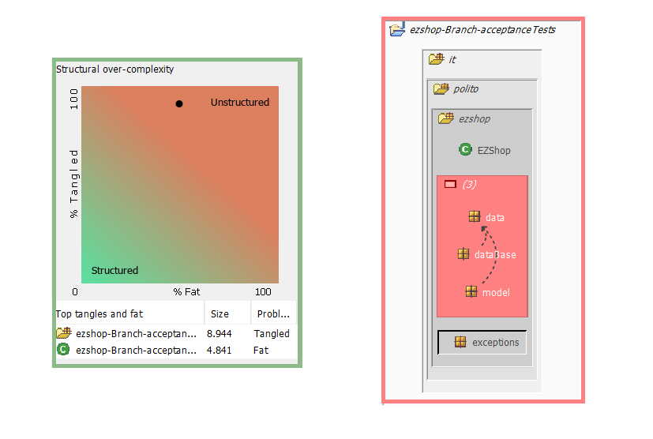
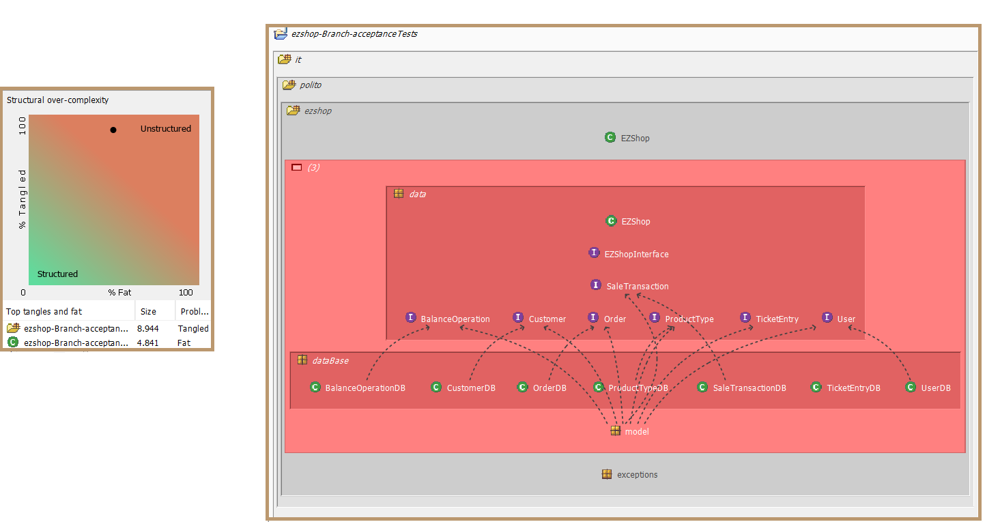
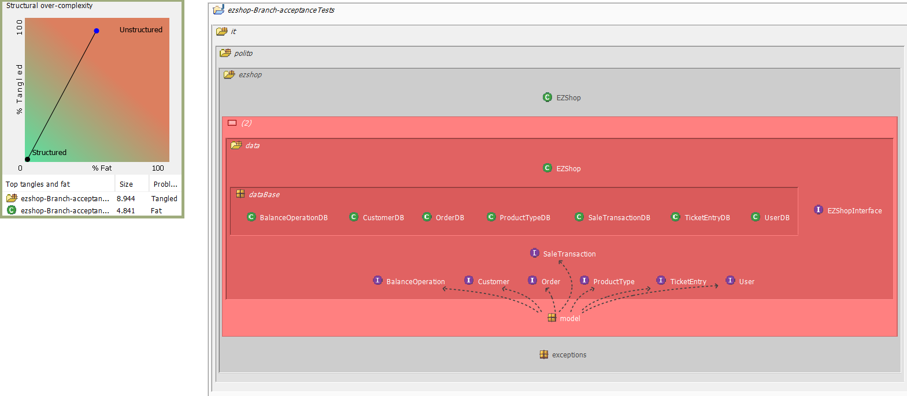
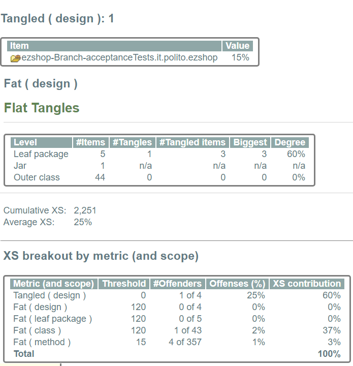
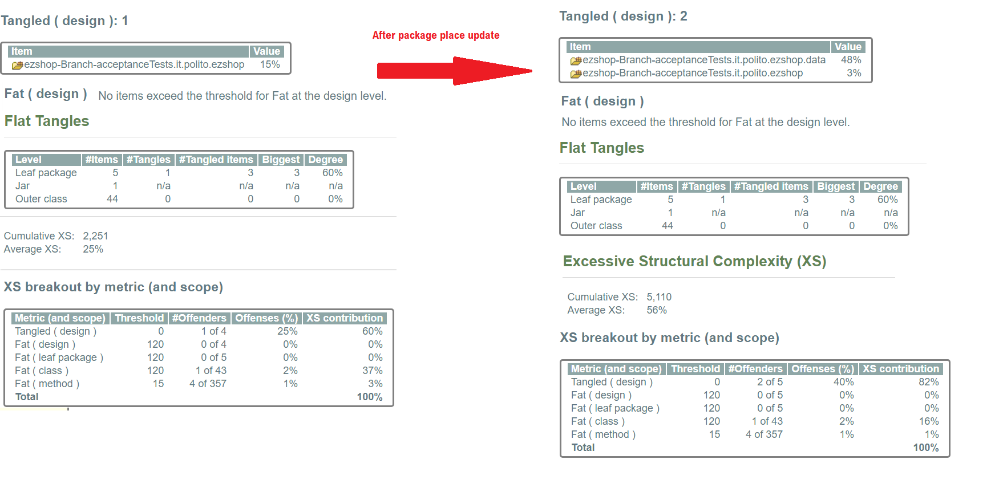

# Design assessment

The goal of this document is to analyse the structure of your project

# Levelized structure map

### Structure 101 is applied to the project.

# Structural over complexity chart

### Structure 101 is applied to the project and the structural over complexity chart is produced:

### Our project's Structural Complexity Chart:

### Optimized project's Structural Complexity Chart:

# Size metrics

Report of the metrics about the size of the project, collected using Structure 101:

| Metric                                    | Measure |
| ----------------------------------------- | ------- |
| Packages                                  |    7     |
| Classes (outer)                           |    43     |
| Classes (all)                             |     43   |
| NI (number of bytecode instructions)      |    9,150      |
| LOC (non comment non blank lines of code) |     	~ 3,934    |

# Items with XS

| Item | Tangled | Fat  | Size | XS   |
| ---- | ------- | ---- | ---- | ---- |
|      |    %98  |   %53| 7 packages     |  Cumulative XS:	2,251, Average XS:	25%    |
|      |         |      |      |      |

# Package level tangles

# Summary analysis

### After changes of package places, it is observable that xs contribution of fat (class) is reduced while xs contribution of tangled(design) is increased. It is showed in the screen capture above.

### Our project's Structural Complexity Chart:

### Optimized project's Structural Complexity Chart:

