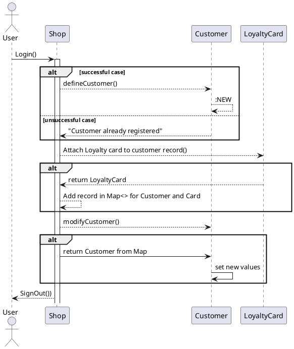
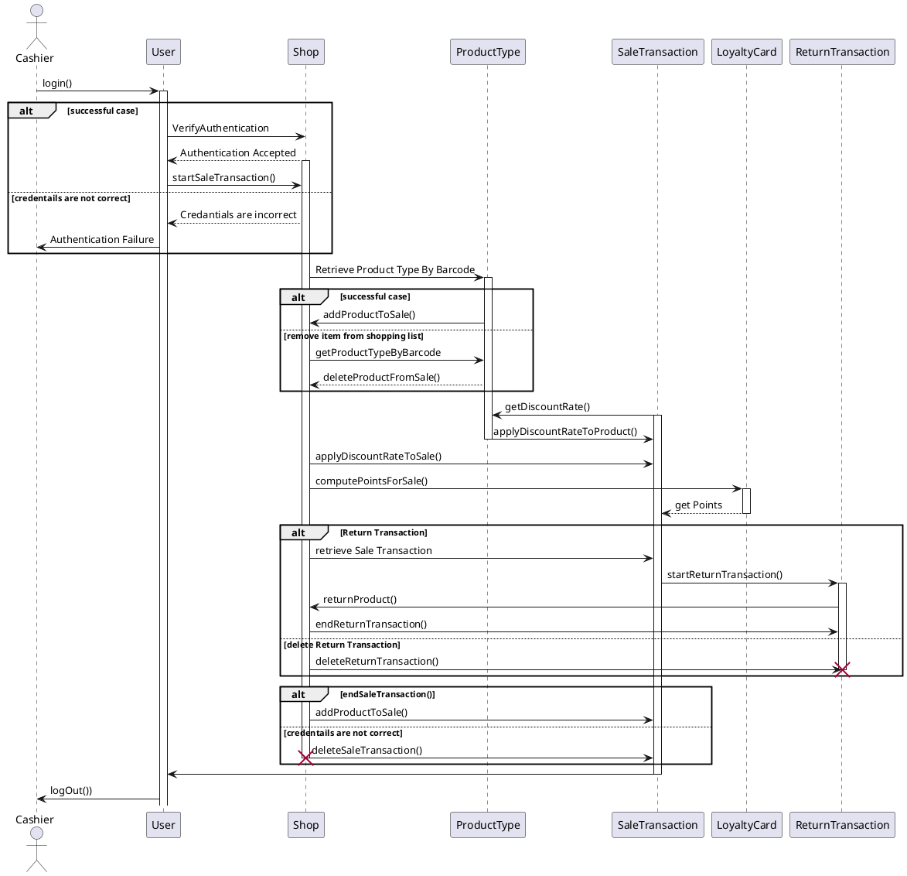

# Design Document 


Authors: FRANCESCO SPAGNOLETTI, DORIANA MONACO, SELEN AKKAYA, SAEID ESMAEILI
D
Version: 0.1

Date 27/04/2021


# Contents

- [Design Document](#design-document)
- [Contents](#contents)
- [Instructions](#instructions)
- [High level design](#high-level-design)
- [Low level design](#low-level-design)
- [Verification traceability matrix](#verification-traceability-matrix)
- [Verification sequence diagrams](#verification-sequence-diagrams)
  - [FR 3-1 Create product type X](#fr-3-1-create-product-type-x)
  - [FR 4-2 Modify product type location](#fr-4-2-modify-product-type-location)
  - [FR 4 Modify product type price per unit](#fr-4-modify-product-type-price-per-unit)
  - [FR 1-1 Create user and define rights](#fr-1-1-create-user-and-define-rights)
  - [FR 1-2 Delete user](#fr-1-2-delete-user)
  - [FR 1 Modify user rights](#fr-1-modify-user-rights)
  - [FR 4-4 Order of product type X issued](#fr-4-4-order-of-product-type-x-issued)
  - [FR 5: Manage customers and cards](#fr-5-manage-customers-and-cards)
  - [FR 8-1 Record debit](#fr-8-1-record-debit)
  - [FR 8-2 Record credit](#fr-8-2-record-credit)
  - [FR 8-3 List debit and credits](#fr-8-3-list-debit-and-credits)
  - [FR 8-4 Compute balance](#fr-8-4-compute-balance)
  - [Scenario: login](#scenario-login)
  - [Scenario: logout](#scenario-logout)
  - [Scenario: Manage SaleTransaction and ReturnTransaction](#scenario-manage-saletransaction-and-returntransaction)
  - [Scenario 7-1: Manage payment by valid credit card](#scenario-7-1-manage-payment-by-valid-credit-card)
  - [Scenario 7-2: Manage payment by invalid credit card](#scenario-7-2-manage-payment-by-invalid-credit-card)
  - [Scenario 7-3: Manage credit card payment with not enough credit](#scenario-7-3-manage-credit-card-payment-with-not-enough-credit)

# Instructions

The design must satisfy the Official Requirements document, notably functional and non functional requirements

# High level design 

<discuss architectural styles used, if any>
<report package diagram>

```plantuml
package EZShop
package GUI
package EZShopException
EZShop --> GUI
EZShop --> EZShopException
```

Architectural pattern used: façade. 

# Low level design

<for each package, report class diagram>

```plantuml
left to right direction

interface EZShopInterface 

class Shop {
    + Map<Integer,User> Users
    + Map<Integer,ProductType> Products
    + Map<Integer,Order> Orders
    + Map<Integer,Customer> Customers
    + Map<String,LoyaltyCard> LoyaltyCards
    + Map<Integer,String> CustomerCards
    + Map<Integer,BalanceOperation> Transactions
    + reset()
    + createUser()
    + deleteUser()
    + getallUsers()
    + getUser()
    + updateUserRights()
    + login()
    + logout()
    + createProductType()
    + updateProduct()
    + deleteProductType()
    + getAllProductTypes()
    + getProductTypeByBarCode()
    + getProductTypesByDescription()
    + updateQuantity()
    + updatePosition()
    + issueOrder()
    + payOrderFor()
    + payOrder()
    + recordOrderArrival()
    + getAllOrders()
    + defineCustomer()
    + modifyCustomer()
    + deleteCustomer()
    + getCustomer()
    + getAllCustomers()
    + createCard()
    + attachCardToCustomer()
    + modifyPointsOnCard()
    + startSaleTransaction()
    + addProductToSale()
    + deleteProductFromSale()
    + applyDiscountRateToProduct()
    + applyDiscountRateToSale()
    + computePointsForSale()
    + endSaleTransaction()
    + deleteSaleTransaction()
    + getSaleTransaction()
    + startReturnTransaction()
    + returnProduct()
    + endReturnTransaction()
    + deleteReturnTransaction()
    + receiveCashPayment()
    + receiveCreditCardPayment()
    + returnCashPayment()
    + returnCreditCardPayment()
    + recordBalanceUpdate()
    + getCreditsAndDebits()
    + computeBalance()
}
Shop ..|> EZShopInterface : implements
class AccountBook {
    + Balance
    + setBalance()
    + getBalance()
}
AccountBook - Shop
class BalanceOperation {
 +ID
 +description
 +amount
 +date
}
AccountBook -- "*" BalanceOperation

class Credit 
class Debit

Credit --|> BalanceOperation
Debit --|> BalanceOperation

class Order

Order --|> Debit
SaleTransaction --|> Credit
ReturnTransaction --|> Debit


class ProductType{
    + ID
    +barCode
    +description
    +sellPrice
    +quantity
    +discountRate
    +notes
    + setDescription()
    + setCode()
    + setSellPrice()
    + getSellPrice()
    + setNote()
    + setQuantity()
    + getQuantity()
    + setdiscountRate()
    + getdiscountRate()
}

Shop - "*" ProductType

class SaleTransaction {
    +cost
    +paymentType
    +discountRate
    + status
    + Map<String,ProductType> Products
    + setStatus()
    + getStatus()
    + setdiscountRate()
    + getdiscountRate()
    + getCost()
    + setCost()
    + getPaymentType()
    + addProduct()
    + removeProduct()
}
SaleTransaction - "*" ProductType

class Quantity {
    +quantity
    +setQuantity()
}
(SaleTransaction, ProductType)  .. Quantity

class LoyaltyCard {
    + ID
    + cardCode
    + setID()
    + points
    + setPoint()
}

class Customer {
    + ID
    +name
    +surname
    +setName()
    +setSurname()
}

LoyaltyCard "0..1" - Customer

SaleTransaction "*" -- "0..1" LoyaltyCard

note "Persistent data:  ProductType,BalanceOperation,LoyaltyCard,Customer,Order,User" as N1
class Position {
    +aisleID
    +rackID
    +levelID
    + setAisleID()
    + getAisleID()
    + setrackID()
    + getrackID()
    + setLevel()
    + getLevel()

}

ProductType - "0..1" Position


class Order {
    + ID
  +supplier
  +pricePerUnit
  +quantity
  +status
  + setStatus()
  + getStatus()
}

Order "*" - ProductType

class ReturnTransaction {
  + Map<String,ProductType> ReturnProducts
  +quantity
  +returnedValue
  + addReturnProduct()
  + removeReturnProduct()
}

class User {
    + ID
    + Username
    + Password
    + Role
    + getUsername()
    + getRole()
    + setRole()
}

User "1..*" -- "1" Shop

ReturnTransaction "*" - SaleTransaction
ReturnTransaction "*" - ProductType


```


# Verification traceability matrix

\<for each functional requirement from the requirement document, list which classes concur to implement it>

|      | Shop | ReturnTransaction | SaleTransaction | Debit | Credit | ProductType | BalanceOperation | Position | Customer | LoyaltyCard | Quantity | User | Order | AccountBook |
| :--- | ---- | ----------------- | --------------- | ----: | ------ | ----------- | ---------------- | -------- | -------- | ----------- | -------- | ---- | ----- | ----------- |
| FR1  | x    |                   |                 |       |        |             |                  |          |          |             |          | x    |       |             |
| FR3  | x    |                   |                 |       |        | x           |                  |          |          |             |          |      |       |             |
| FR4  | x    |                   |                 |       |        | x           | x                | x        |          |             |          |      | x     | x           |
| FR5  | x    |                   |                 |       |        |             |                  |          | x        | x           |          |      |       |             |
| FR6  | x    | x                 | x               |       |        | x           | x                | x        |          |             | x        |      |       |             |
| FR7  | x    | x                 | x               |       |        |             | x                |          |          |             |          |      |       | x           |
| FR8  | x    |                   |                 |     x | x      |             | x                |          |          |             |          |      |       | x           |


# Verification sequence diagrams 
\<select key scenarios from the requirement document. For each of them define a sequence diagram showing that the scenario can be implemented by the classes and methods in the design>


## FR 3-1 Create product type X

```plantuml
autonumber 
Shop -> ProductType : createProductType()
ProductType -> ProductType : New()
Shop -> Position : updatePosition()
Position -> Position : setAisleID()
Position -> Position : setRackID()
Position -> Position : setLevel()
```

## FR 4-2 Modify product type location

```plantuml
autonumber
Shop -> ProductType : getProductTypesByBarCode()
Shop -> Position : updatePosition()
Position -> Position : setAisleID()
Position -> Position : setRackID()
Position -> Position : setLevel()
```

## FR 4 Modify product type price per unit

```plantuml
autonumber
Shop -> ProductType : getProductTypesByBarCode()
ProductType -> ProductType : getSellPrice()
ProductType -> ProductType : setSellPrice()

```

## FR 1-1 Create user and define rights

```plantuml
autonumber
Shop -> User : createUser()
User -> User : New()

```

## FR 1-2 Delete user

```plantuml
autonumber
Shop -> User : deleteUser()
User -> User : Remove() by Garbage collector
```

## FR 1 Modify user rights

```plantuml
autonumber
Shop -> User : getUser()
User -> User : getRole()
User -> User : setRole()
```

## FR 4-4 Order of product type X issued

```plantuml
autonumber
Shop -> Order : issueOrder()
Order -> Order : setStatus()
```

##  FR 5: Manage customers and cards


## FR 8-1 Record debit
```plantuml
autonumber
Shop -> Debit : recordDebit()
Debit -> Debit : :NEW()
```
## FR 8-2 Record credit
```plantuml
autonumber
Shop -> Credit : recordCredit()
Credit -> Credit : :NEW()
```

## FR 8-3 List debit and credits
```plantuml
autonumber
Shop -> AccountBook : getCreditsAndDebits()
AccountBook -> Shop: return List<BalanceOperation>
```

## FR 8-4 Compute balance
```plantuml
autonumber
Shop -> AccountBook : computeBalance()
AccountBook -> AccountBook: getBalance()
```

## Scenario: login
```plantuml
user -->shop:GetUsername()
shop -->system:ValidUsername()
system -->shop:Response()
user -->shop:GetPassword()
shop -->system:ValidPassword()
system -->shop:Response()
user -->system:login
```
## Scenario: logout

## Scenario 7-2: Manage payment by invalid credit card
```plantuml
creditCard -->pos:Read C.number()  
pos -->DB:Validate C.number with Luhn algorithm()
DB -->pos:C.number invalid, issue warning
pos -->creditCard:Exit with error
```
## Scenario 7-3: Manage credit card payment with not enough credit
```plantuml
creditCard -->pos:Read C.number()  
pos -->DB:Validate C.number with Luhn algorithm()
DB -->pos:Authentication Response()
pos -->creditCard:Ask to credit sale price()
creditCard -->DB:RequestToBalance()
DB -->pos: Balance not sufficient, issue warning()
pos -->creditCard:Exit with error()
```


@enduml

