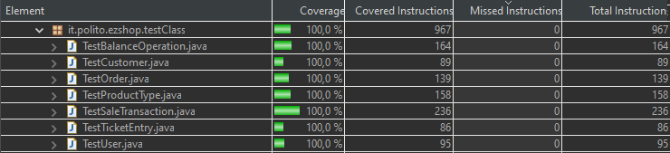
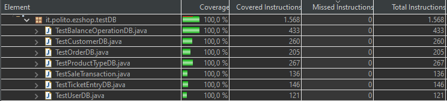

# Unit Testing Documentation

Authors:FRANCESCO SPAGNOLETTI, DORIANA MONACO, SELEN AKKAYA, SAEID ESMAEILI

Date: 19.05.2021

Version: Version 1.0

# Contents

- [Black Box Unit Tests](#black-box-unit-tests)

- [White Box Unit Tests](#white-box-unit-tests)

# Black Box Unit Tests
### **Class *UserDB* - method *AddUser***
 | Valid / Invalid | Description of the test case     | JUnit test case |
 | --------------- | -------------------------------- | --------------- |
 | valid           | UserDB.addUser == UserDB.getUser | testAddUser     |

 

**Criteria for method *AddUser*:**
	
 - Value of the input

**Predicates for method *AddUser*:**

| Criteria           | Predicate  |
| ------------------ | ---------- |
| Value of the input | [1,maxint] |
|                    | [minint,0) |

**Boundaries**:

| Criteria           | Boundary values |
| ------------------ | --------------- |
| Value of the input | 1,maxint        |
|                    | 0,minint        |

**Combination of predicates**:

| Value of the input |  Valid / Invalid | Description of the test case               | JUnit test case                           |
| ------------------ | --------------- | ------------------------------------------  | ----------------------------------------- |
| User u, [1,maxint] | Valid           | userEntry.AddUser(u.getId(), u.getId())-->True  | it.polito.ezshop.testClass.TestUserDB.testAddUser |
|                    |                 | userEntry.AddUser(u.getPassword())-->True  | it.polito.ezshop.testClass.TestUserDB.testAddUser |
|                    |                 | userEntry.AddUser(u.getUsername())-->True  | it.polito.ezshop.testClass.TestUserDB.testAddUser |
|                    |                 | userEntry.AddUser(u.getRole())-->True  | it.polito.ezshop.testClass.TestUserDB.testAddUser |

 

### **Class *UserDB* - method *removeUser***
 | Valid / Invalid | Description of the test case   | JUnit test case |
 | --------------- | ------------------------------ | --------------- |
 | valid           | UserDB.contains(User)--> FALSE | testRemoveUser  |

**Criteria for method *AddUser*:**
	
 - Value of the input

**Predicates for method *AddUser*:**

| Criteria           | Predicate  |
| ------------------ | ---------- |
| Value of the input | [1,maxint] |
|                    | [minint,0) |

**Boundaries**:

| Criteria           | Boundary values |
| ------------------ | --------------- |
| Value of the input | 1,maxint        |
|                    | 0,minint        |

**Combination of predicates**:

| Value of the input |  Valid / Invalid | Description of the test case               | JUnit test case                           |
| ------------------ | --------------- | ------------------------------------------  | ----------------------------------------- |
| User u, [1,maxint] | Valid           | userEntry.removeUser(u.getId(), u.getId())-->True  | it.polito.ezshop.testClass.TestUserDB.testRemoveUser |
|                    |                 | userEntry.removeUser(u.getPassword())-->True  | it.polito.ezshop.testClass.TestUserDB.testRemoveUser |
|                    |                 | userEntry.removeUser(u.getUsername())-->True  | it.polito.ezshop.testClass.TestUserDB.testRemoveUser |
|                    |                 | userEntry.removeUser(u.getRole())-->True  | it.polito.ezshop.testClass.TestUserDB.testRemoveUser |

 ### **Class *UserDB* - method *updateUser***
 | Valid / Invalid | Description of the test case  | JUnit test case |
 | --------------- | ----------------------------- | --------------- |
 | valid           | UserDB.getUser == User.update | testUpdateUser  |

 **Criteria for method *updateUser*:**
	
 - Value of the input

**Predicates for method *updateUser*:**

| Criteria           | Predicate  |
| ------------------ | ---------- |
| Value of the input | [1,maxint] |
|                    | [minint,0) |

**Boundaries**:

| Criteria           | Boundary values |
| ------------------ | --------------- |
| Value of the input | 1,maxint        |
|                    | 0,minint        |

**Combination of predicates**:

| Value of the input |  Valid / Invalid | Description of the test case               | JUnit test case                           |
| ------------------ | --------------- | ------------------------------------------  | ----------------------------------------- |
| User u, [1,maxint] | Valid           | userEntry.updateUser(u.getId(), u.getId())-->True  | it.polito.ezshop.testClass.TestUserDB.testUpdateUser |
|                    |                 | userEntry.updateUser(u.getPassword())-->True  | it.polito.ezshop.testClass.TestUserDB.testUpdateUser |
|                    |                 | userEntry.updateUser(u.getUsername())-->True  | it.polito.ezshop.testClass.TestUserDB.testUpdateUser |
|                    |                 | userEntry.updateUser(u.getRole())-->True  | it.polito.ezshop.testClass.TestUserDB.testUpdateUser |

### **Class *OrderDB* - method *AddOrder***
 | Valid / Invalid | Description of the test case  | JUnit test case |
 | --------------- | ----------------------------- | --------------- |
 | valid           | orderDB.getOrder == Order.add | testUpdateUser  |

 
 **Criteria for method *AddOrder*:**
	
 -  Value of the input
 -  codeLength 
 -  State    

**Predicates for method *AddOrder*:**

| Criteria           | Predicate  |
| ------------------ | ---------- |
| Value of the input | [1,maxint] |
|                    | [minint,0) |
| codeLength      | String.length==12       |  
| State              | "ISSUED","NOT ISSUED"| 

**Boundaries**:

| Criteria           | Boundary values |
| ------------------ | --------------- |
| Value of the input | 1,maxint        |
|                    | 0,minint        |

**Combination of predicates**:

| Value of the input |  Valid / Invalid | Description of the test case               | JUnit test case                           |
| ------------------ | --------------- | ------------------------------------------  | ----------------------------------------- |
| Order o, [1,maxint] | Valid           | orderEntry.addOrder(o.getId(),1)-->True  | it.polito.ezshop.testClass.TestOrderDB .testAddOrder |
| Order o, String.length==12   |                 | orderEntry.addOrder(o.getProductCode(),"6291041500213")-->True  | it.polito.ezshop.testClass.TestOrderDB.testAddOrder |
| Order o, "ISSUED"    |         |                 | orderEntry.addOrder(o.getStatus(),"ISSUED")-->True  | it.polito.ezshop.testClass.TestOrderDB.testAddOrder |
| Order o,  [1,maxint]     |                 | orderEntry.addOrder(u.getQuantity(),10)-->True  | it.polito.ezshop.testClass.TestOrderDB.testAddOrder |

### **Class *User* - method *getUserId***

**Criteria for method *getUserId*:**
	
 - Sign of the input
 - Value of the input

**Predicates for method *getUserId*:**

| Criteria           | Predicate  |
| ------------------ | ---------- |
| Sign of the input  | Positive   |
|                    | Negative   |
| Value of the input | [1,maxint] |
|                    | [minint,0) |

**Boundaries**:

| Criteria           | Boundary values |
| ------------------ | --------------- |
| Value of the input | 1,maxint        |
|                    | 0,minint        |

**Combination of predicates**:

| Value of the input | Sign of the input | Valid / Invalid | Description of the test case               | JUnit test case                           |
| ------------------ | ----------------- | --------------- | ------------------------------------------ | ----------------------------------------- |
| [1,maxint]         | positive          | Valid           | user.setUserId(2);user.getUserId()-->True  | it.polito.ezshop.testClass.TestUser.testId |
| [minint,0)         | negative          | Valid           | user.setUserId(-2);user.getUserId()-->True | it.polito.ezshop.testClass.TestUser.testId |

### **Class *Customer* - method *getCustomerId***

**Criteria for method *getCustomerId*:**
	
 - Sign of the input
 - Value of the input

**Predicates for method *getCustomerId*:**

| Criteria           | Predicate  |
| ------------------ | ---------- |
| Sign of the input  | Positive   |
|                    | Negative   |
| Value of the input | [1,maxint) |
|                    | (minint,0) |

**Boundaries**:

| Criteria           | Boundary values |
| ------------------ | --------------- |
| Value of the input | 1,maxint        |

**Combination of predicates**:

| Value of the input | Sign of the input | Valid / Invalid | Description of the test case                           | JUnit test case                               |
| ------------------ | ----------------- | --------------- | ------------------------------------------------------ | --------------------------------------------- |
| [1,maxint]         | positive          | Valid           | Customer.setCustomerId(55);user.getCustomerId()-->True | it.polito.ezshop.testClass.TestCustomer.testId |

 ### **Class *SaleTransaction* - method *getPrice()***

**Criteria for method *getPrice*:**
	
 -  Integer
 -  Sigh of the price

**Predicates for method *getPrice*:**

| Criteria          | Predicate |
| ----------------- | --------- |
| Integer           | YES       |
|                   | NO        |
| Sign of the input | Positive  |
|                   | Negative  |

**Boundaries**:

| Criteria          | Boundary values |
| ----------------- | --------------- |
| Sign of the input | 0 1             |

**Combination of predicates**:

| Integer | Sign of the input | Valid / Invalid | Description of the test case                    | JUnit test case                                          |
| ------- | ----------------- | --------------- | ----------------------------------------------- | -------------------------------------------------------- |
| YES     | positive          | Valid           | ezshop.setPrice(5);ezshop.getPrice()-->True     | it.polito.ezshop.testClass.TestSaleTransaction.testPrice |
|         | Negative          | Valid           | ezshop.setPrice(-5);ezshop.getPrice()-->True    | it.polito.ezshop.testClass.TestSaleTransaction.testPrice |
| NO      | positive          | Valid           | ezshop.setPrice(50.7);ezshop.getPrice()-->True  | it.polito.ezshop.testClass.TestSaleTransaction.testPrice |
|         | negative          | Valid           | ezshop.setPrice(-4.46);ezshop.getPrice()-->True | it.polito.ezshop.testClass.TestSaleTransaction.testPrice |

 ### **Class *SaleTransaction* - method *setPrice()***

**Criteria for method *setPrice*:**
	
 -  Integer
 -  Sigh of the price

**Predicates for method *setPrice*:**

| Criteria          | Predicate |
| ----------------- | --------- |
| Integer           | YES       |
|                   | NO        |
| Sign of the input | Positive  |
|                   | Negative  |

**Boundaries**:

| Criteria          | Boundary values |
| ----------------- | --------------- |
| Sign of the input | 0, 1            |

**Combination of predicates**:

| Sign of the price | Integer | Valid / Invalid | Description of the test case                    | JUnit test case                                          |
| ----------------- | ------- | --------------- | ----------------------------------------------- | -------------------------------------------------------- |
| Positive          | YES     | Valid           | ezshop.getPrice();ezshop.setPrice(5)-->True     | it.polito.ezshop.testClass.TestSaleTransaction.testPrice |
|                   | NO      | Valid           | ezshop.getPrice();ezshop.setPrice(-5)-->True    | it.polito.ezshop.testClass.TestSaleTransaction.testPrice |
| Negative          | YES     | Valid           | ezshop.getPrice();ezshop.setPrice(50.7)-->True  | it.polito.ezshop.testClass.TestSaleTransaction.testPrice |
|                   | NO      | Valid           | ezshop.getPrice();ezshop.setPrice(-4.46)-->True | it.polito.ezshop.testClass.TestSaleTransaction.testPrice |

 ### **Class *BalanceOperation* - method *getMoney()***

**Criteria for method *getMoney*:**
	
 -  Integer
 -  Sigh of the price

**Predicates for method *getMoney*:**

| Criteria          | Predicate |
| ----------------- | --------- |
| Integer           | YES       |
|                   | NO        |
| Sign of the input | Positive  |
|                   | Negative  |

**Boundaries**:

| Criteria          | Boundary values |
| ----------------- | --------------- |
| Sign of the input | -1, 0, 1        |

**Combination of predicates**:

| Integer | Sign of the input | Valid / Invalid | Description of the test case                              | JUnit test case                                           |
| ------- | ----------------- | --------------- | --------------------------------------------------------- | --------------------------------------------------------- |
| YES     | positive          | Valid           | BalanceOperation.setMoney(5);ezshop.getMoney()-->True     | it.polito.ezshop.testClass.TestBalanceOperation.testMoney |
|         | Negative          | Valid           | BalanceOperation.setMoney(-5);ezshop.getMoney()-->True    | it.polito.ezshop.testClass.TestBalanceOperation.testMoney |
| NO      | positive          | Valid           | BalanceOperation.setMoney(23.5);ezshop.getMoney()-->True  | it.polito.ezshop.testClass.TestBalanceOperation.testMoney |
|         | negative          | Valid           | BalanceOperation.setMoney(-23,5);ezshop.getMoney()-->True | it.polito.ezshop.testClass.TestBalanceOperation.testMoney |

 ### **Class *Order* - method *getOrderId()***

**Criteria for method *getOrderId*:**
	
 -  Integer
 -  Sigh of the price

**Predicates for method *getOrderId*:**

| Criteria           | Predicate  |
| ------------------ | ---------- |
| Sign of the input  | Positive   |
|                    | Negative   |
| Value of the input | [1,maxint) |
|                    | (minint,0) |

**Boundaries**:

| Criteria           | Boundary values |
| ------------------ | --------------- |
| Value of the input | 1,maxint        |
|                    | 0,minint        |

**Combination of predicates**:

| Value of the input | Sign of the input | Valid / Invalid | Description of the test case           | JUnit test case                                  |
| ------------------ | ----------------- | --------------- | -------------------------------------- | ------------------------------------------------ |
| [1,maxint]         | positive          | Valid           | Order.setId(1);Order.getId()-->True    | it.polito.ezshop.testClass.TestOrder.testOrderId |
| [minint,0)         | negative          | Valid           | Order.setId(-100);Order.getId()-->True | it.polito.ezshop.testClass.TestOrder.testOrderId |

 ### **Class *ProductType* - method *getProductId()***

**Criteria for method *getProductId*:**
	
 -  Integer
 -  Sigh of the price

**Predicates for method *getProductId*:**

| Criteria           | Predicate  |
| ------------------ | ---------- |
| Sign of the input  | Positive   |
|                    | Negative   |
| Value of the input | [1,maxint) |
|                    | (minint,0) |

**Boundaries**:

| Criteria           | Boundary values |
| ------------------ | --------------- |
| Value of the input | 1,maxint        |
|                    | 0,minint        |

**Combination of predicates**:

| Value of the input | Sign of the input | Valid / Invalid | Description of the test case                       | JUnit test case                                   |
| ------------------ | ----------------- | --------------- | -------------------------------------------------- | ------------------------------------------------- |
| [1,maxint]         | positive          | Valid           | ProductType.setId(10);ProductType.getId()-->True   | it.polito.ezshop.testClass.TestProductType.testId |
| [minint,0)         | negative          | Valid           | ProductType.setId(-100);ProductType.getId()-->True | it.polito.ezshop.testClass.TestProductType.testId |

# White Box Unit Tests

### Test cases definition
    

| Unit name                   | JUnit test case                                                                                                     |
| --------------------------- | ------------------------------------------------------------------------------------------------------------------- |
| User                        | TestUser.testId                                                                                             |
|                             | TestUser.testUsername|
|                             | TestUser.testPassword|
|                             | TestUser.testRole|
| Customer                    | TestCustomer.testCustomerName                                   |
|                             | TestCustomer.testCustomerCard|
|                             | TestCustomer.testId|
|                             | TestCustomer.CustomerClass|
|                             | TestCustomer.testPoints|
| Order                       | TestOrder.testBalanceId|
|                             | TestOrder.testProductCode|
|                             | TestOrder.testPricePerUnit|
|                             | TestOrder.testQuantity|
|                             | TestOrder.testStatus|
|                             | TestOrder.testOrderId|
|                             | TestProductType.testQuantity|
| ProductType                 | TestProductType.testLocation|
|                             | TestProductType.testNote|
|                             | TestProductType.testProductDescription|
|                             | TestProductType.testBarCode|
|                             | TestProductType.testPricePerUnit|
|                             | TestProductType.testId|
| SaleTransaction             | TestSaleTransaction.testPrice|
|                             | TestSaleTransaction.testDiscountRate|
|                             | TestSaleTransaction.testTicketNumber|
|                             | TestSaleTransaction.testTicketsList|
| TicketEntryDB               | TestTicketEntry.testId|
|                             | TestTicketEntry.testProductDescription|
|                             | TestTicketEntry.testAmount|
|                             | TestTicketEntry.testPricePerUnit|
|                             | TestTicketEntry.testDiscountRate|
| BalanceOperationDB          | TestBalanceOperation.testBalanceId|
|                             | TestBalanceOperation.testDate|
|                             | TestBalanceOperation.testMoney|
|                             | TestBalanceOperation.testType|

### Code coverage report

### Loop coverage analysis

| Unit name                   | Loop rows | Number of iterations | JUnit test case                                  |
| --------------------------- | --------- | -------------------- | ------------------------------------------------ |
| User.getUserId()            | -         | -                    | testId1();testId2()                                |
| Customer.getCustomerId()    | -         | -                    | testId1();testId2()                                |
| SaleTransaction.getPrice()  | -         | -                    | testPrice1();testPrice2();testPrice3();testPrice4(); |
| SaleTransaction.setPrice()  | -         | -                    | testPrice1();testPrice2();testPrice3();testPrice4(); |
| BalanceOperation.getMoney() | -         | -                    | testMoney1();testMoney2();testMoney3();testMoney4(); |
| Order.getProductId()        | -         | -                    | testOrderId1();testOrderId2()                      |
| ProductType.getProductId    | -         | -                    | testId1();testId2()                                |

