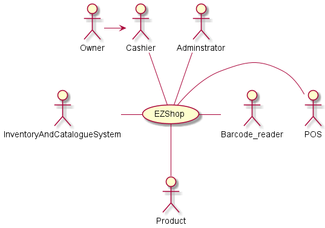
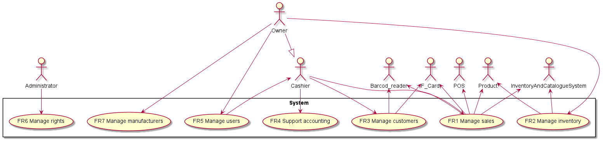
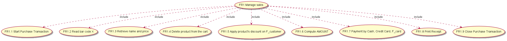
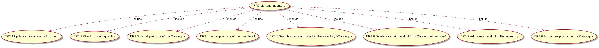
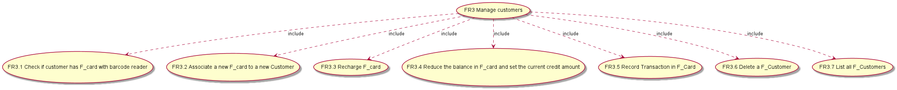
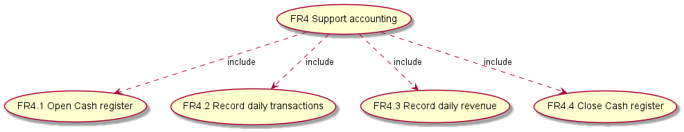
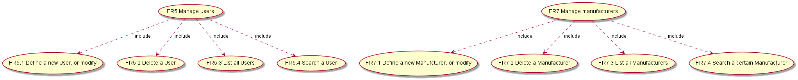
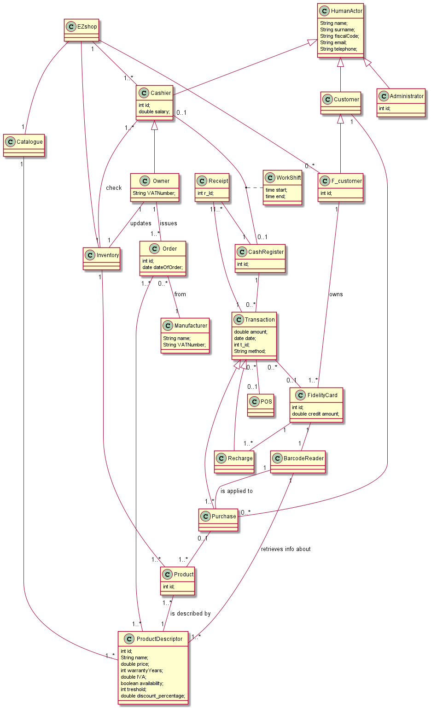
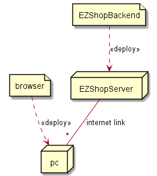

# Requirements Document - EZ Shop

Authors: FRANCESCO SPAGNOLETTI, DORIANA MONACO, SELEN AKKAYA 

Version: 1.0

Date 21/04/2021

# Contents

- [Essential description](#essential-description)
- [Stakeholders](#stakeholders)
- [Context Diagram and interfaces](#context-diagram-and-interfaces)
	+ [Context Diagram](#context-diagram)
	+ [Interfaces](#interfaces) 
	
- [Stories and personas](#stories-and-personas)
- [Functional and non functional requirements](#functional-and-non-functional-requirements)
	+ [Functional Requirements](#functional-requirements)
	+ [Non functional requirements](#non-functional-requirements)
- [Use case diagram and use cases](#use-case-diagram-and-use-cases)
	+ [Use case diagram](#use-case-diagram)
	+ [Use cases](#use-cases)
- [Glossary](#glossary)
- [System design](#system-design)
- [Deployment diagram](#deployment-diagram)

# Essential description

Small shops require a simple application to support the owner or
manager. 
A small shop (ex a food shop) occupies 50-200 square meters,
sells 500-2000 different item types, has one or few cash registers.

EZShop is a software application to

- manage sales
- manage inventory
- manage customers
- support accounting

# Stakeholders

| Stakeholder name | Description                                                                                                 |
| ---------------- | ----------------------------------------------------------------------------------------------------------- |
| Administrator    | Manages the application, has access to all functions.                                                       |
| Cashier          | Uses the application to use the Cash Register (open and close), to add and check products in the Inventory. |
| Customer         | Take part of a sale, he has a recipt at the end of the Transaction. He can pay with Cash or Card (POS).     |
| F_Customer       | He is a Customer with a F_Card. With that he can have discount on certain products.                         |
| F_Card           | A Fidelity card associated to a F_Customer, he can also pay with it.                                        |
| Owner            | Funds the development and operation of the application.                                                     |
| Product          | What the shop sell.                                                                                         |
| Manufacturer     | Where the Owner refound his Inventory.                                                                      |
| Recipt           | To give to the Customer. To store for accounting.                                                           |
| Pos.API          | In order to pay with card, the .API given by the bank has to be used.                                       |
| Barcode_reader   | In order to read the id of a Product and F_Card.                                                            |

# Context Diagram and interfaces

## Context Diagram

## Interfaces

| Actor                       | Logical Interface | Physical Interface                       |
| :-------------------------- | :---------------- | :--------------------------------------- |
| Administrator               | Web GUI           | Screen keyboard on PC                    |
| Owner                       | Owner Web GUI     | Screen keyboard mouse on PC, touchscreen |
| Cashier                     | Cashier Web GUI   | Screen keyboard mouse on PC, touchscreen |
| Pos                         | API               | Internet link                            |
| Barcode_reader              | API               | Wireless, cable                          |
| InventoryAndCatalogueSystem | Database          | Hard Disk                                |
| Product                     | ID                | Barcode                                  |
| F_Card                      | ID                | Barcode                                  |

# Stories and personas

The following personas and stories are meant to cover different profiles of the Owner and Customer

John is 53, it is the owner of a food shop. Since its shop is small, he likes to
manage it by himself, in order to quickly fix any kind of problem that can arise. 
He loves technology because it simplifies his life, but he is not used to it, that's 
why he chose EZShop. EZShop allows him to control his shop with a very easy-to-use 
interface, with which he feels very comfortable.

Micheal is 30, it has recently started his own activity: a men perfumery.
He is also a husband and a father, he really wants to have success to make 
his family proud, so he is working hard. Before opening his shop, Michael knew 
he would love to use EZShop, a software that shows him the economic trend of the
activity, in order to choose the right product to invest on. 

Laura is 23. She is passionate about cinema, one day she would like to be the biggest 
movie director in Italy. Saturday night she loves watching old movies and fortunately
there are a few movie shops in town, which allow to rent movies. That one in corso Roma
is, of course, her favorite one. It uses EZShop to manage fidelity cards, which allow her
to save money because of offers, discounts available for regular customers. 

# Functional and non functional requirements

## Functional Requirements

| ID      | Description                                                                                |
| :------ | :----------------------------------------------------------------------------------------- |
| **FR1** | Manage Sales                                                                               |
| FR1.1   | Start Purchase Transaction.                                                                |
| FR1.2   | Read bar code X.                                                                           |
| FR1.3   | Retrieve name and price given barcode X from Catalogue and add it to the cart              |
| FR1.4   | Delete product from the cart.                                                              |
| FR1.5   | Apply product's discount on F_customer                                                     |
| FR1.6   | Compute AMOUNT                                                                             |
| FR1.7   | Payment by Cash, Credit Card, F_card                                                       |
| FR1.8   | Print Receipt                                                                              |
| FR1.9   | Close Purchase Transaction                                                                 |
| **FR2** | Manage Inventory                                                                           |
| FR2.1   | Update stock amount of product after each complete Purchase Transaction from Inventory     |
| FR2.2   | Check product quantity.                                                                    |
| FR2.3   | List all products of the Catalogue                                                         |
| FR2.4   | List all products of the Inventory                                                         |
| FR2.5   | Search a certain product in the Inventory/Catalogue                                        |
| FR2.6   | Delete a certain product from Catalogue/Inventory                                          |
| FR2.7   | Add a new product in the Inventory                                                         |
| FR2.8   | Add a new product in the Catalogue                                                         |
| **FR3** | Manage Customers                                                                           |
| FR3.1   | Check if customer has F_card with barcode reader.                                          |
| FR3.2   | Associate a new F_card to a new Customer                                                   |
| FR3.3   | Recharge F_card                                                                            |
| FR3.4   | Reduce the balance in F_card and set the current credit amount.                            |
| FR3.5   | Record Transaction in F_Card.                                                              |
| FR3.6   | Delete a F_Customer                                                                        |
| FR3.7   | List all F_Customers                                                                       |
| **FR4** | Support Accounting                                                                         |
| FR4.1   | Open Cash register                                                                         |
| FR4.2   | Record daily transactions                                                                  |
| FR4.3   | Record daily revenue  ()                                                                   |
| FR4.4   | Close Cash register                                                                        |
| **FR5** | Manage Users                                                                               |
| FR5.1   | Define a new User, or modify an existing User (Cashier, ...)                               |
| FR5.2   | Delete a User                                                                              |
| FR5.3   | List all Users                                                                             |
| FR5.4   | Search a User                                                                              |
| **FR6** | Manage rights. Authorize access to functions to specific actors according to access rights |
| **FR7** | Manage Manufacturers                                                                       |
| FR7.1   | Define a new Manufcturer, or modify an existing Manufacturer                               |
| FR7.2   | Delete a Manufacturer                                                                      |
| FR7.3   | List all Manufacturers                                                                     |
| FR7.4   | Search a certain Manufacturer                                                              |

### Access right, actor vs function

| Function | Admin | Owner | Cashier |
| :------- | :---: | :---: | ------: |
| FR1      |  yes  |  yes  |     yes |
| FR2.3    |  yes  |  yes  |     yes |
| FR2.4    |  yes  |  yes  |     yes |
| FR2.5    |  yes  |  yes  |     yes |
| FR2.6    |  yes  |  yes  |      no |
| FR2.7    |  yes  |  yes  |      no |
| FR2.8    |  yes  |  yes  |      no |
| FR3      |  yes  |  yes  |     yes |
| FR4      |  yes  |  yes  |     yes |
| FR5      |  yes  |  yes  |      no |
| FR6      |  yes  |  no   |      no |
| FR7      |  yes  |  yes  |      no |

## Non Functional Requirements

| ID   | Type            | Description                                                                                         |
| :--- | :-------------- | :-------------------------------------------------------------------------------------------------- |
| NFR1 | Usability       | EZShop should have easy interface to be used by any user                                            |
| NFR2 | Performance     | All functions should complete in < 0.5 sec                                                          |
| NFR3 | Maintainability | Adminstrator should be able to maintain Inventory info.                                             |
| NFR4 | Privacy         | The data of one user should not be disclosed to other users, except for the Owner and Administrator |
| NFR5 | Privacy         | Do not store Credit Card number for security reasons.                                               |

# Use case diagram and use cases

## Use case diagram

## Use cases

## Use Case 1, UC1.1 - Start Purchase Transaction
| **Actors involved** | **Cashier**                                         |
| :------------------ | --------------------------------------------------- |
| Precondition        | Cashier C exists, Cashier C is logged in the system |
| Post condition      | Transaction T is generated.                         |
| Nominal Scenario    | Cashier C starts the transaction                    |

## Use Case 2, UC1.2 - Read bar code X
| **Actors involved** | **Cashier**                                                                                |
| :------------------ | ------------------------------------------------------------------------------------------ |
| Precondition        | Cashier C exists, Cashier C is logged in the system                                        |
|                     | Barcode Reader BR exists, BR is turn-on, ProductBarcode p_BCode exists                     |
|                     | product's BarcodeNumber p_BNum exists                                                      |
| Post condition      | p_BCode is scanned by BR                                                                   |
| Nominal Scenario    | Cashier C scan p_BCode                                                                     |
| Variants            | p_BCode is spoiled(not scannable). BR cannot read p_BCode. Cashier enters p_BNum manually. |
|                     | BR is not activated/working,  Cashier enters p_BNum manually.                              |

### Scenario 1.2.1 (exception case)  
| **Scenario**   | **Barcode reader is not working**                   |
| :------------- | --------------------------------------------------- |
| Precondition   | Cash Register is on.                                |
|                | EZShop Sytem is on.                                 |
|                | Barcode Reader is not ready.                        |
|                | Pos system is on.                                   |
|                | Cashier is is logged in to the system.              |
| Step#          | Description                                         |
| 1              | Cashier starts transaction                          |
| 2              | Read barcode of product X.                          |
| 3              | Notify of issue of Barcode Reader                   |
| 4              | Write barcode number manually                       |
| 5              | Retrieve name and price given barcode X             |
| 6              | Read barcode of fidelity_card(if exist)             |
| 7              | Confirm that all products are scanned.              |
| 8              | Compute total expense                               |
| 9              | Apply product's discount on F_customer              |
| 10             | Payment by cash/Credit Card/f_card                  |
| Post condition | System notifies that Barcode Reader is not ready.   |
|                | Transaction is pending.                             |
|                | System shows option to enter Barcode Code manually. |

## Use Case 3, UC1.3 - Retrieve name and price given barcode X from Catalogue and add it to the cart
| **Actors involved** | **Cashier**                                                                          |
| :------------------ | ------------------------------------------------------------------------------------ |
| Precondition        | product P exists ,Cashier C exists, Cashier C is logged in the system                |
|                     | ProductDescriptor PD exists, Catalogue CA exists, ProductBarcode p_BCode exists.     |
|                     | P.p_BCode = PD.p_BCode && PD.p_BCode = CA.p_BCode                                    |
| Post condition      | Retrieve the PD.name and PD.price.                                                   |
| Nominal Scenario    | Cashier monitors info of product P                                                   |
| Variants            | Product P is not recorded into inventory/catalogue system. Product P cannot be sold. |

### Scenario 1.3.1 (exception case) 
| **Scenario**   | **Associated product not recorded into inventory/catalogue system** |
| :------------- | ------------------------------------------------------------------- |
| Precondition   | Cash Register is on.                                                |
|                | EZShop Sytem is on.                                                 |
|                | Barcode Reader is ready.                                            |
|                | Pos system is on.                                                   |
|                | Cashier is is logged in to the system.                              |
|                | Associated product is not recorded into inventory/catalogue system  |
| Step#          | Description                                                         |
| 1              | Cashier starts transaction                                          |
| 2              | Read barcode of product X.                                          |
| 3              | System notifies that product X is not recorded.                     |
| 4              | Remove product X from transaction                                   |
| 5              | Retrieve name and price given barcode X                             |
| 6              | Read barcode of fidelity_card(if exist)                             |
| 7              | Confirm that all products in the cart are scanned.                  |
| 8              | Compute total expense                                               |
| 9              | Apply product's discount on F_customer                              |
| 10             | Payment by cash/Credit Card/f_card                                  |
| Post condition | Compleate transaction without product X                             |

### Scenario 1.3.2 (exception case) When Barcode of product X is spoiled.
| **Scenario**   | **Barcode of product X is spoiled**                                         |
| :------------- | --------------------------------------------------------------------------- |
| Precondition   | Cash Register is on.                                                        |
|                | EZShop Sytem is on.                                                         |
|                | Barcode Reader is ready.                                                    |
|                | Pos system is on.                                                           |
|                | Cashier is is logged in to the system.                                      |
|                | Barcode of product X is spoiled.                                            |
| Step#          | Description                                                                 |
| 1              | Cashier starts transaction                                                  |
| 2              | Read barcode of product X.                                                  |
| 3              | Write barcode number manually                                               |
| 4              | Retrieve name and price given barcode X                                     |
| 5              | Read barcode of fidelity_card(if exist)                                     |
| 6              | Confirm that all products in the cart are scanned.                          |
| 7              | Compute total expense                                                       |
| 8              | Apply product's discount on F_customer                                      |
| 9              | Payment by cash/Credit Card/f_card                                          |
| Post condition | Transaction is pending untill barcode number is entered manually to system. |
|                | Select to option to enter Barcode Code manually.                            |

## Use Case 4, UC1.4 - Delete product from the cart
| **Actors involved** | **Cashier**                                                                         |
| :------------------ | ----------------------------------------------------------------------------------- |
| Precondition        | product P exists ,Cashier C exists, Cashier C is logged in the system               |
|                     | ProductDescriptor PD exists, Catalogue CA exists, ProductBarcode p_BCode exists.    |
|                     | P.p_BCode = PD.p_BCode && PD.p_BCode = CA.p_BCode                                   |
|                     | delete button button_Delete exist.                                                  |
| Post condition      | Cashier selects non-required product P and remove it by delete button button_Delete |
| Nominal Scenario    | Cashier removes unwanted product P.                                                 |

## Use Case 5, UC1.5 - Apply product's discount on F_customer
| **Actors involved** | **F_Customer**, **Cashier**                                                          |
| :------------------ | ------------------------------------------------------------------------------------ |
| Precondition        | F_customer FC exists ,FidalityCard F_card exists.                                    |
|                     | Cashier C exists, Cashier C is logged in the system                                  |
|                     | Product P exists, ProductDescriptor PD exists, Catalogue CA exists                   |
|                     | FC.f_ID=F_card.f_ID                                                                  |
|                     | P.p_BCode = PD.p_BCode && PD.p_BCode = CA.p_BCode                                    |
|                     | SELECT discount FROM FidalityCard WHERE PD.discount = FC.discount AS discount_amount |
|                     | SUM (price) FROM ProductDescriptor WHERE P.p_BCode = PD.p_BCode AS total_amount.     |
| Post condition      | Compute (total_amount - discount_amount)                                             |
| Nominal Scenario    | Monitor (total_amount - discount_amount).                                            |

## Use Case 6, UC1.6 - Compute AMOUNT 
| **Actors involved** | **Cashier**                                                                      |
| :------------------ | -------------------------------------------------------------------------------- |
| Precondition        | Cashier C exists, Cashier C is logged in the system                              |
|                     | Product P exists, ProductDescriptor PD exists, Catalogue CA exists               |
|                     | P.p_BCode = PD.p_BCode && PD.p_BCode = CA.p_BCode                                |
|                     | SUM (price) FROM ProductDescriptor WHERE P.p_BCode = PD.p_BCode AS total_amount. |
| Post condition      | Compute total_amount                                                             |
| Nominal Scenario    | Monitor total_amount                                                             |

## Use Case 7, UC1.7 - Payment by Cash, Credit Card, F_card
| **Actors involved** | **Cashier**                                                                        |
| :------------------ | ---------------------------------------------------------------------------------- |
| Precondition        | Transaction T exist,                                                               |
|                     | Cashier C exists, Cashier C is logged in the system                                |
|                     | T.payment_method is selected as Cash OR CreditCard OR F_card                       |
| Post condition      | Computed amount of money is taken by cash/CreditCar/F_Card                         |
| Nominal Scenario    | Purchase is compleated successfully.                                               |
| Variants            | Needed amount of money is not exist in cards or by cash. Transection is cancelled. |

### Scenario 1.7.1 (exception case) 
| **Scenario**   | **Pos system is not available**               |
| :------------- | --------------------------------------------- |
| Precondition   | Cash Register is on.                          |
|                | EZShop Sytem is on.                           |
|                | Barcode Reader is ready.                      |
|                | Pos system is not available.                  |
|                | Cashier is loged in to the system.            |
| Step#          |                                               |
| 1              | Cashier starts transaction                    |
| 2              | Read barcode of product X.                    |
| 3              | Retrieve name and price given barcode X       |
| 4              | Read barcode of fidelity_card(if exist)       |
| 5              | Confirm that all products are scanned.        |
| 6              | Compute total expense                         |
| 7              | Apply product's discount on F_customer        |
| 8              | Payment by only cash/f_card is suitable       |
| Post condition | System notifies that Pos system is not ready. |
|                | Transaction is pending.                       |
|                | System shows other options of payment.        |

### Scenario 1.7.2 (exception case)  When customer does not have enough amount of money/credit 
| **Scenario**  | **When customer does not have enough amount of money/credit** |
| :------------ | ------------------------------------------------------------- |
| precondition  | Cash Register is on.                                          |
|               | EZShop Sytem is on.                                           |
|               | Barcode Reader is ready.                                      |
|               | Pos system is ready.                                          |
|               | Cashier is is loged in to the system.                         |
|               | Customer does not have enough amount of money/credit          |
| Step#         |                                                               |
| 1             | Cashier starts transaction                                    |
| 2             | Read barcode of product X.                                    |
| 3             | Retrieve name and price given barcode X                       |
| 4             | Read barcode of fidelity_card(if exist)                       |
| 5             | Confirm that all products are scanned.                        |
| 6             | Compute total expense                                         |
| 7             | Apply product's discount on F_customer                        |
| 8             | Payment by cash/Credit Card/f_card                            |
| 9             | Required amount of money is taken                             |
| 10            | Cancel transaction option is selected.                        |
| postcondition | Print the canceled transaction reciept                        |
|               | Purchase transaction is canceled.                             |

## Use Case 8, UC1.8 - Print Receipt
| **Actors involved** | **Cashier**                                                                      |
| :------------------ | -------------------------------------------------------------------------------- |
| Precondition        | Cashier C exists, Cashier C is logged in the system                              |
|                     | Transaction T exists, P.p_BCode = PD.p_BCode && PD.p_BCode = CA.p_BCode          |
|                     | SUM (price) FROM ProductDescriptor WHERE P.p_BCode = PD.p_BCode AS total_amount. |
|                     | Retrieve the PD.name and PD.price and write down in Transaction T.               |
|                     | Compute total_amount write in ending of Transaction T.                           |
| Post condition      | Print reciept of Transaction T                                                   |
| Nominal Scenario    | Print out each product' info and total amount of transaction as a Receipt        |

## Use Case 9, UC1.9 - Close Purchase Transaction
| **Actors involved** | **Cashier**                                                              |
| :------------------ | ------------------------------------------------------------------------ |
| Precondition        | Transaction T exist, Cashier C exists, Cashier C is logged in the system |
|                     | Accounting Acoun_Sys exist                                               |
| Post condition      | Transaction T is recorded in Acoun_Sys                                   |
| Nominal Scenario    | Transaction T is compleated.                                             |

## Use Case 10, UC2.1 - Update stock amount of product after transaction
| **Actors involved** |                                                                                                |
| :------------------ | ---------------------------------------------------------------------------------------------- |
| Precondition        | ProductDescriptor PD exists, Inventory I exists, Transaction T completed,                      |
|                     | Q is amount of product sold in this transaction, Product P1..Pn exist /*products sold*/        |
| Post condition      | Quantity of product is modified                                                                |
| Nominal Scenario    | When transaction T is completed successfully, products sold P1..Pn are removed from inventory, |
|                     | quantity for that category of products is decreased                                            |

### Scenario 2.1.1
| **Scenario**   | **Decrease quantity of product**                                            |
| :------------- | --------------------------------------------------------------------------- |
| Precondition   | Inventory I exists, Product P exists, I contains P, Transaction T completed |
| Post condition | Quantity of product--                                                       |
| Step#          | Description                                                                 |
| 1              | I.remove(P1)..I.remove(Pn)                                                  |
| 2              | q = I.getQuantity(PD)                                                       |
| 3              | I.setQuantity(PD, q-Q)                                                      |

### Scenario 2.1.2
| **Scenario** | **Product quantity below threshold**                                            |
| :----------- | ------------------------------------------------------------------------------- |
| Precondition | ProductDescriptor PD exists, Inventory I is opened, owner O/cashier C logged in |
| Step#        | Description                                                                     |
| 1            | Owner O/Cashier C search PD into inventory I                                    |
| 2            | I retrieves information about PD                                                |
| 3            | I.getQuantity(PD) < PD.threshold                                                |
| 4            | Owner O issues new order for that product                                       |

## Use Case 11, UC2.2 - Add new product to Catalogue
| **Actors involved** | **Owner**                                                                                                       |
| :------------------ | --------------------------------------------------------------------------------------------------------------- |
| Precondition        | Owner O exists and he's logged in, ProductDescriptor PD doesn't exist, Catalogue C doesn't contain PD           |
| Post condition      | PD is created                                                                                                   |
|                     | C.push(PD)                                                                                                      |
| Nominal scenario    | Owner wants to sell a new product, he creates a new product descriptor PD for it and pushes it into Catalogue C |

## Use Case 12, UC2.3 - Add new product to Inventory
| **Actors involved** | **Owner**                                                                                                                                |
| :------------------ | ---------------------------------------------------------------------------------------------------------------------------------------- |
| Precondition        | ProductDescriptor PD exists, Catalogue C contains PD, Inventory I exists, Product P doesn't exits                                        |
| Post condition      | Product P is created                                                                                                                     |
|                     | I.add(PD,P) /*Add product P into category PD of inventory*/                                                                              |
|                     | q = I.getQuantity(PD)                                                                                                                    |
|                     | I.setQuantity(PD,q+1) /*increase quantity for that category of products*/                                                                |
| Nominal scenario    | Owner creates a new product into the system to sell it. The product is inserted into inventory and quantity is updated                   |
| Variants            | ProductDescriptor PD doesn't exist. When owner tries to creat a new product, system shows "Error, no such type of product in catalogue." |

## Use Case 13, UC2.4 - Remove product from Catalogue
| **Actors involved** | **Owner**                                                                                       |
| :------------------ | ----------------------------------------------------------------------------------------------- |
| Actors involved     | Owner                                                                                           |
| Precondition        | Catalogue C exists, ProductDescriptor PD exists, C contains PD, Owner O exists and is logged in |
| Post condition      | C.remove(PD)                                                                                    |
| Nominal scenario    | Owner doesn't want to sell anymore a certain product PD. He removes it from catalogue C         |

## Use Case 14, UC2.5 - Remove product from inventory
| **Actors involved** | **Owner** **Cashier**                                                                                     |
| :------------------ | --------------------------------------------------------------------------------------------------------- |
| Precondition        | Product P exists, ProductDescriptor PD exists, Inventory I exists and contains PD and P                   |
| Post condition      | I.remove(PD,P) /*Remove product P from category PD*/                                                      |
|                     | q=I.getQuantity(PD)                                                                                       |
|                     | I.setQuantity(PD,q-1) /*decrease quantity for that category of products*/                                 |
| Nominal scenario    | Cashier (or owner) removes manually a product from inventory and quantity for that category is decreased. |
| Variants            | Inventory I doesn't contain product P. Generate error.                                                    |

## Use Case 15, UC2.6 - Search product in inventory
| **Actors involved** | **Owner** **Cashier**                              |
| :------------------ | -------------------------------------------------- |
| Precondition        | Inventory I exists, Product P exists, I contains P |
| Nominal Scenario    | Cashier C/Owner O inserts product id               |
|                     | I retrieves object P and shows its information     |

## Use Case 16, UC3.1 - Search a certain F_Customer

| **Actors Involved** | Cashier / Owner                                                                                                                            |
| :------------------ | :----------------------------------------------------------------------------------------------------------------------------------------- |
| Precondition        | F_Customer FU exists, F_Card CA exists                                                                                                     |
| Post condition      |                                                                                                                                            |
| Nominal Scenario    | A Cashier E search inside the application the informations of a F_Customer FU through the reading of the F_Card CA with the Barcode Reader |
|                     | and the informations are showned on the screen                                                                                             |
| Variants            | The Cashier E can use other personal informations of F_Customer FU for the search                                                          |

## Use Case 17, UC3.2 - Associate a new F_card to a new Customer

| **Actors Involved** | Cashier / Owner                                                                  |
| :------------------ | :------------------------------------------------------------------------------- |
| Precondition        | F_Customer FU does not exists, F_Card CA does not exists                         |
| Post condition      | F_Customer FU exists, F_Card CA exists                                           |
| Steps#              | Description                                                                      |
| 1                   | A Cashier E creates a new F_Customer FU associated with F_Card CA in the system; |
| 2                   | The Cashier E enters all fields of a F_Customer FU ;                             |
| 3                   | The application assigns a unique ID to the F_Customer and F_Card.                |

## Use Case 18, UC3.3 - Recharge F_card

| **Actors Involved** | Cashier / Owner                                                   |
| :------------------ | :---------------------------------------------------------------- |
| Precondition        | F_Customer FU exists, F_Card CA exists                            |
| Post condition      | CA.credit_amount = CA.credit_amount + A                           |
| Steps#              | Description                                                       |
| 1                   | The Cashier E open a new transaction T on Cash Register CR        |
| 2                   | E Add a certain amount of money A to CA through a payment from FU |
| 3                   | CR prints the Receipt R                                           |
| 4                   | E close the transaction.                                          |
| Variants            | Payment by Cash or POS                                            |

## Use Case 19, UC3.4 - Reduce the balance in F_card and set the current credit amount.

| **Actors Involved** | Cashier / Owner                                       |
| :------------------ | :---------------------------------------------------- |
| Precondition        | F_Customer FU exists, F_Card CA exists,               |
| Post condition      | CA.credit_amount updated                              |
| Nominal Scenario    | Transaction T made by F_Card CA of a certain amount A |

### Scenario 3.4.1

| **Scenario**     | CA.credit_amount > A                                                 |
| :--------------- | :------------------------------------------------------------------- |
| Precondition     | F_Customer FU exists, F_Card CA exists                               |
| Post condition   | CA.credit_amount = CA.credit_amount - A                              |
| Nominal Scenario | Transaction T made by F_Card CA of a certain amount A was successful |

### Scenario 3.4.2

| **Scenario**     | CA.credit_amount < A                                                     |
| :--------------- | :----------------------------------------------------------------------- |
| Precondition     | F_Customer FU exists, F_Card CA exists                                   |
| Post condition   | Show ERROR on screen                                                     |
| Nominal Scenario | Transaction T made by F_Card CA of a certain amount A was not successful |

## Use Case 20, UC3.5 - Record Transaction in F_Card.

| **Actors Involved** | Cashier / Owner                                                                                |
| :------------------ | :--------------------------------------------------------------------------------------------- |
| Precondition        | F_Customer FU exists, F_Card CA exists, CA.credit_amount > A, Transaction T does not exists,   |
| Post condition      | Transaction T exists associated with F_Card CA                                                 |
| Nominal Scenario    | After a Transaction T made by F_Card CA, the informations of T are recorded associated with CA |

## Use Case 21, UC3.6 - Delete a F_Customer

| **Actors Involved** | Cashier / Owner                                                                         |
| :------------------ | :-------------------------------------------------------------------------------------- |
| Precondition        | F_Customer FU exists, F_Card CA exists,                                                 |
| Post condition      | F_Customer FU does not exists, F_Card CA does not exists                                |
| Nominal Scenario    | Cashier E delete all the informations of F_Customer FU and F_Card CA in the application |

## Use Case 22, UC3.7 - List all F_Customers

| **Actors Involved** | Cashier / Owner                                                                            |
| :------------------ | :----------------------------------------------------------------------------------------- |
| Precondition        | F_Customer FU exists, F_Card CA exists,                                                    |
| Post condition      |                                                                                            |
| Nominal Scenario    | All the F_Customers are showed in a list with their main informations (ID, Name, Surname,) |

## Use Case 23, UC4.1 - Open Cash register

| **Actors Involved** | Owner / Cashier                                      |
| :------------------ | :--------------------------------------------------- |
| Precondition        | Cashier C exists, Cashs Register CA OFF              |
| Post condition      |                                                      |
| Nominal Scenario    | Cashier C Open a Cash Register CA to start recording |
|                     | data for accounting                                  |

## Use Case 24, UC4.2 - Record daily transactions

| **Actors Involved** |                                                 |
| :------------------ | :---------------------------------------------- |
| Precondition        | Transaction T exists                            |
| Post condition      | Transaction T recorded                          |
| Nominal Scenario    | The system automatically record a Transaction T |

## Use Case 25, UC4.3 - Record daily revenue  

| **Actors Involved** |                                                                  |
| :------------------ | :--------------------------------------------------------------- |
| Precondition        | Daily Revenue DR does not exists                                 |
| Post condition      | Daily Revenue DR exists                                          |
| Nominal Scenario    | Daily Revenue DR is calculated by software relationship with pos |

## Use Case 26, UC4.4 - Close Cash register 

| **Actors Involved** | Owner / Cashier                                     |
| :------------------ | :-------------------------------------------------- |
| Precondition        | Cashier C exists, Cashs Register CA is ON           |
| Post condition      |                                                     |
| Nominal Scenario    | Cashier C Close a Cash Register CA to end recording |
|                     | data for accounting                                 |

## Use Case 27, UC5.1 - Define a new User, or modify an existing User (Cashier, ...)
| **Actors Involved** | Owner                                                   |
| :------------------ | :------------------------------------------------------ |
| Precondition        | Cashier C does not exist                                |
| Post condition      | Cashier C added in the system (modified)                |
| Nominal Scenario    | Owner creates a new Cashier C and populates its fields. |
|                     | Owner modifies one or more fields of Cashier C          |

## Use Case 28, UC5.2 - Delete a User account
| **Actors Involved** | Owner                                |
| :------------------ | :----------------------------------- |
| Precondition        | Cashier C exists                     |
| Post condition      | Cashier C deleted from the system    |
| Nominal Scenario    | Owner select a Cashier C to delete   |
| Variants            | Administrator can delete any account |

## Use Case 29, UC5.3 -List all Users 
| **Actors Involved** | Owner                                     |
| :------------------ | :---------------------------------------- |
| Precondition        |                                           |
| Post condition      | List all users in the system              |
| Nominal Scenario    | Owner can see list all user in the system |

## Use Case 30, UC5.4 -Search a User 
| **Actors Involved** | Owner                                                |
| :------------------ | :--------------------------------------------------- |
| Precondition        | Cashier C exists                                     |
| Post condition      | Search Cashier C in the system and show all the info |
| Nominal Scenario    | Owner O search a user in the system                  |

## Use Case 31, UC6 -Manage rights. Authorize access to functions to specific actors according to access rights
| **Actors Involved** | Administrator                                                                              |
| :------------------ | :----------------------------------------------------------------------------------------- |
| Precondition        | Administrator A exists                                                                     |
| Post condition      |                                                                                            |
| Nominal Scenario    | Administrator Manages the application, manage the rights and can have access to everything |

## Use Case 32, UC7.1 - Define a new Manufcturer, or modify an existing Manufacturer
| **Actors Involved** | Owner                                                         |
| :------------------ | :------------------------------------------------------------ |
| Precondition        | Manufcturer M does not exists                                 |
| Post condition      | Manufcturer M added in the system ( modified)                 |
| Nominal Scenario    | Owner O creates a new Manufcturer M and populates its fields. |
|                     | Owner O modifies one or more fields of Manufcturer M          |

## Use Case 33, UC7.2 - Delete a Manufacturer 
| **Actors Involved** | Owner                                    |
| :------------------ | :--------------------------------------- |
| Precondition        | Manufcturer M exists                     |
| Post condition      | Manufcturer M deleted from the system    |
| Nominal Scenario    | Owner O select a Manufcturer M to delete |

## Use Case 34, UC7.3 - List all Manufacturers
| **Actors Involved** | Owner                                                        |
| :------------------ | :----------------------------------------------------------- |
| Precondition        |                                                              |
| Post condition      | All Manufcturer in the system are showed                     |
| Nominal Scenario    | Owner can see the list of all the Manufcturers in the system |

## Use Case 35, UC7.4 - Search a certain Manufacturer 
| **Actors Involved** | Owner                                            |
| :------------------ | :----------------------------------------------- |
| Precondition        | Manufacturer M exists                            |
| Post condition      | Manufacturer M informations are showed on screen |
| Nominal Scenario    | Owner can Search Manufcturer M in the system     |

# Glossary

# System Design

Not really meaningful in this case. Only software components are needed.

# Deployment Diagram

Client server model. The application runs on a server or virtual machine, any client accesses it through PC.

